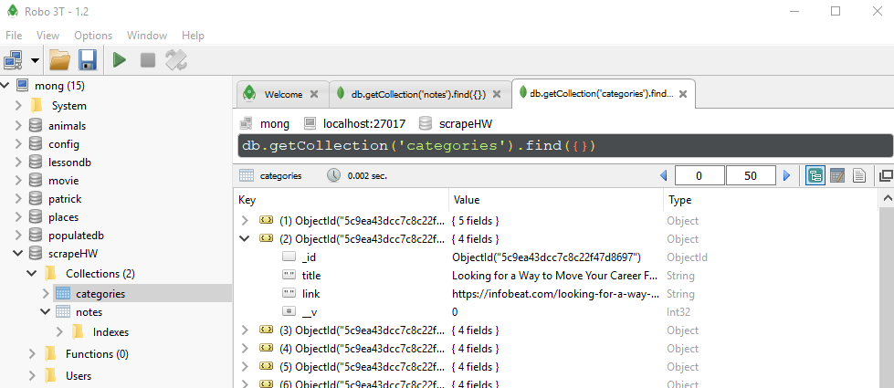
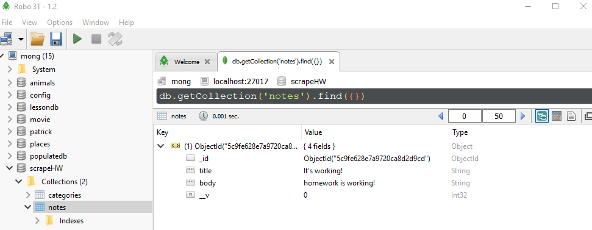

Scraper Homework - just to be clear, I don't think this is a good idea.
scraping data from infobeat.com for tips for daily life:  Database and Notes are saving as seen in the screen shots below.  I was not able to get the Heroku deployment to work.  

